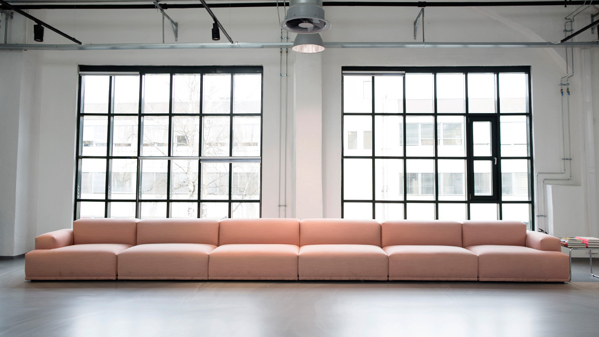

export { default as theme } from "./themes/creuna-theme";
import Red from "layouts/Red";
import Blue from "layouts/Blue";
import Yellow from "layouts/Yellow";
import Dark from "layouts/Dark";
import Light from "layouts/Light";
import { Notes } from "mdx-deck";
import { Image } from "mdx-deck";
import { Appear } from "mdx-deck";
import { Code } from "mdx-deck";
import { Split } from "mdx-deck/layouts";
import { Head } from "mdx-deck";
import ImageWithBoxes from "components/Image-with-boxes.js";
import Quote from "components/Quote.js";
import Intro from "intro-pages/intro.js";
import "styles/global-styles.js";

<Head>
  <title>Creuna mal</title>
  <link rel="shortcut icon" type="image/png" href="assets/unicorn.png" />
</Head>

<!--
INTRODUCTION-SLIDE
Choose "light" or "dark" theme
!-->

<Intro
  theme="dark"
  title="Presentation title"
  subTitle="Subtitle"
  presenterName="Your name"
/>

```notes
Hei hei
```

---

# Overskrift

- en greie
- en greie til
- en annen greie

---

<!--
ImageWithBoxes
Choose background image and text for top and bottom boxes
!-->

<ImageWithBoxes
  backgroundImg="assets/sofa.jpeg"
  boxLabelTop="Text top box"
  boxLabelBottom="Text bottom box"
/>

---

<!--
QUOTES
Choose "red" or "blue" theme
!-->

<Quote theme="light" text="Layout with a quote on white background" />

---

<Quote theme="dark" text="Layout with a quote on black background" />

---

<Quote theme="red" text="Layout with a quote on red background" />

---

<Quote theme="blue" text="Layout with a quote on blue background" />

---

<Quote theme="yellow" text="Layout with a quote on yellow background" />

---

<!--
IMAGE COMPONENT
Background image
!-->

<Image
  src="assets/unicorn.png"
  size="15vw"
  style={{ backgroundRepeat: "repeat" }}
/>

---

<!--
HEADINGS
# = H1
## = H2
...and so on
!-->

# Overskrift 1

## Overskrift 2

### Overskrift 3

#### OVERSKRIFT 4

---

export default Split;



## Overskrift

- Kjempefin liste
- Hallo
- Hei

---

[Fin link](https://www.creuna.no)

---

export default Red;

# Overskrift

1. Første ting
2. Andre ting
3. Tredje ting

---

<Code>Hallo dette er kode</Code>

---

| Tabell         | 1     | 2   |
| -------------- | ----- | --- |
| En greie       | hurra | :P  |
| En greie til   | jippi | :D  |
| En annen greie | miip  | :)  |

---

export default Blue;

---

export default Red;
